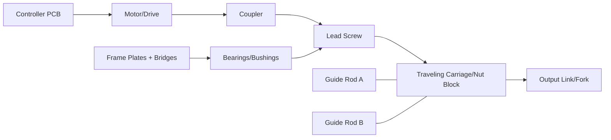

# Actuator Part Breakdown (From Image)

[Back to Actuator README](README.md)

This is a first-pass decomposition from `images/Lucy-Mk-II-limb.jpg`.  
It is intended to bootstrap CAD partitioning and procurement, then refined after measurements.

## Assembly View

## Independent Parts List

### Structural

| ID | Part Name | Type | Likely Source | Notes |
|---|---|---|---|---|
| P01 | Main side frame plate | Print/Metal | In-house print or metal fab | Board-side main structure |
| P02 | Opposite side frame plate | Print/Metal | In-house print or metal fab | Mirror support plate |
| P03 | Upper bridge/cap plate | Print | In-house print | Ties side plates near top |
| P04 | Lower bridge/end plate | Print | In-house print | Bottom alignment and stiffness |
| P05 | Spacer/standoff blocks | Print/COTS | In-house print or COTS standoff | Sets plate spacing |
| P06 | End clamp/yoke | Print | In-house print | Output-end mechanical clamp |
| P07 | Electronics bracket | Print | In-house print | Mounts PCB to frame |

### Motion/Transmission

| ID | Part Name | Type | Likely Source | Notes |
|---|---|---|---|---|
| M01 | Lead screw/threaded drive rod | Purchased | COTS | Primary linear actuation element |
| M02 | Guide rod A | Purchased | COTS | Carriage guidance |
| M03 | Guide rod B | Purchased | COTS | Carriage guidance |
| M04 | Traveling carriage/nut block | Print + Purchased nut | In-house + COTS | Moves along lead screw |
| M05 | Output link/fork | Print/Metal | In-house print or metal fab | Transfers linear motion outward |
| M06 | Shaft coupler | Purchased | COTS | Motor-to-screw coupling |
| M07 | Bearings/bushings set | Purchased | COTS | Screw/rod support at ends |

### Electronics and Wiring

| ID | Part Name | Type | Likely Source | Notes |
|---|---|---|---|---|
| E01 | Controller PCB | Purchased/Existing | Existing board or COTS | Side-mounted control board |
| E02 | Connectors/headers | Purchased | COTS | Board IO and power connections |
| W01 | Harness bundle | Purchased + custom length | COTS wire/connectors | Power/signal distribution |
| W02 | Strain-relief anchors | Print | In-house print | Cable retention at moving boundaries |

### Hardware

| ID | Part Name | Type | Likely Source | Notes |
|---|---|---|---|---|
| H01 | Machine screws (M3/M4) | Purchased | COTS | Primary fastening family |
| H02 | Nuts/lock nuts | Purchased | COTS | Vibration resistance |
| H03 | Washers | Purchased | COTS | Load distribution |
| H04 | Standoffs | Purchased | COTS | PCB/frame spacing |
| H05 | Set screws/retainers | Purchased | COTS | Rod and coupler retention |

## Printable vs Purchased Split

- Print first:
  - `P03`, `P04`, `P06`, `P07`, `W02`, and draft versions of `P01/P02/M04/M05`
- Purchase first:
  - `M01`, `M02`, `M03`, `M06`, `M07`, `H01-H05`, `E01/E02`, wire/connectors

## First-Pass BOM Seed

| Line | Item | Qty | Status | Action |
|---|---|---|---|---|
| 1 | Side frame plate set (`P01`,`P02`) | 1 set | To model | Create CAD with datum holes first |
| 2 | Bridge plates (`P03`,`P04`) | 1 set | To model | Tie to frame hole pattern |
| 3 | Carriage/nut block (`M04`) | 1 | To model | Build around chosen lead screw nut |
| 4 | Output link (`M05`) | 1 | To model | Define end-interface early |
| 5 | Lead screw (`M01`) | 1 | To source | Pick length/pitch and matching nut |
| 6 | Guide rods (`M02`,`M03`) | 2 | To source | Match carriage linear bearings/bushings |
| 7 | Coupler (`M06`) | 1 | To source | Match motor shaft and screw diameters |
| 8 | Bearing/bushing set (`M07`) | 1 set | To source | Define frame seat dimensions |
| 9 | PCB + connectors (`E01`,`E02`) | 1 set | Existing/verify | Confirm mounting holes and clearances |
| 10 | Fastener kit (`H01-H05`) | 1 set | To source | Standardize M3/M4 family |

## Immediate Next CAD Sequence

1. Freeze purchased interfaces: lead screw, nut, rod diameters, bearing OD/ID, motor shaft, coupler.
2. Model `P01` and `P02` around those interfaces.
3. Model `M04` carriage to match nut + rod spacing.
4. Model `P03`/`P04` bridge plates to lock alignment.
5. Export first STL set and run draft fit prints.
