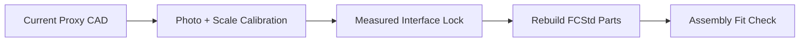

# Photo Match Demonstration

[Back to Actuator README](../../README.md)

## Comparison Image

- Labeled side-by-side: [`photo-vs-current-assembly-labeled.png`](photo-vs-current-assembly-labeled.png)
- Raw side-by-side: [`photo-vs-current-assembly.png`](photo-vs-current-assembly.png)

## Conclusion

Current rendered parts can assemble into a coherent mechanism, but they do **not yet** match the photo-level actuator geometry closely enough for a faithful build.

## What Matches

- Overall concept: dual side-frame structure + linear actuation core
- Presence of guide rods, central drive element, carriage, output-end feature
- Side-mounted electronics concept

## What Does Not Match Yet

- Exact rod spacing and stack-up thickness
- Carriage proportions and nut-block location
- End-yoke geometry and attachment interfaces
- Electronics board shape, mounting points, and offsets
- Fastener pattern density and hardware details

## Required For a True Match

1. At least 3 additional photo angles (front, side, top).
2. One known physical reference dimension in the photo (for scale recovery).
3. Measured COTS selections first: motor, lead screw, nut, bearings, rod diameters.
4. Rebuild each part around those interfaces in native `.FCStd`.

