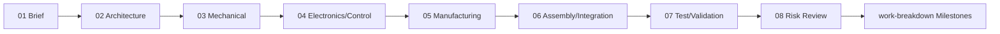
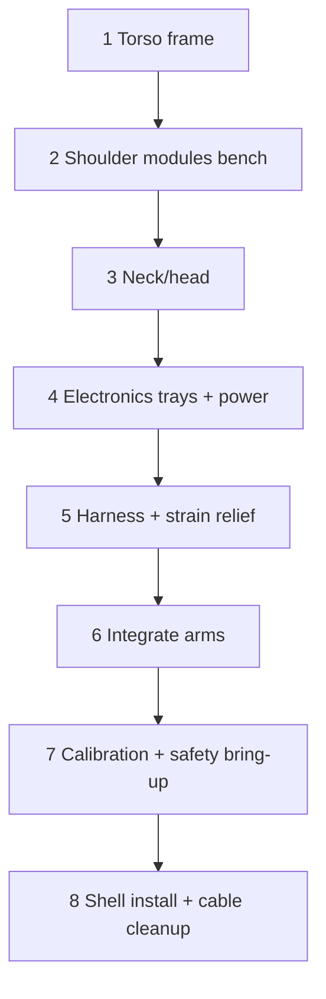
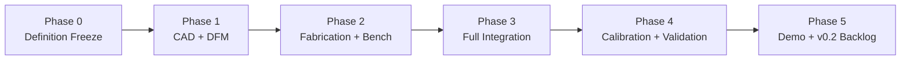

# Lucy Mk-II Step Walkthrough

This document walks through the steps described across the Mk-II planning Markdown files.

## docs/planning/01-project-brief.md

Step flow: define target, then constrain build.

1. Set objective: build credible Mk-II prototype.
2. Lock assumptions: concept-driven, torso-first, staged intelligence.
3. Set v0.1 scope: head/neck, arms, torso, wiring, power/control.
4. Exclude v0.1: walking, dexterous hands, production finish.
5. Define success criteria: mechanical, electrical, control, integration.
6. Apply constraints: printable plastics, vendor-friendly metal, budget reuse.

## docs/planning/02-system-architecture.md

Step flow: split system into subsystems and interfaces.

1. Partition into S1-S7 (structure, shell, actuation, sensing, compute, power, harness).
2. Define each subsystem's purpose and implementation path.
3. Lock interface boundaries (mounts, rails, connectors, messaging layers).

## docs/planning/03-mechanical-design.md

Step flow: kinematics -> loads -> materials -> zone architecture -> CAD outputs.

1. Set geometric conventions (+X/+Y/+Z, origin).
2. Define joint motion targets for neck/shoulder/elbow/wrist.
3. Set preliminary torque/load envelopes.
4. Choose material strategy (PETG/Nylon + 6061 + steel pins).
5. Design by zone (torso, shoulder cartridges, elbow/wrist, head/neck).
6. Standardize fasteners, fits, and tolerances.
7. Deliver CAD package (top assembly, subsystems, drawings, print files).

## docs/planning/04-electronics-control.md

Step flow: power base -> control stack -> sensing -> software layers -> safety.

1. Define supply modes and rail structure.
2. Assign control hardware per module + supervisor.
3. Choose deterministic field bus.
4. Define sensor stack (joint, IMU, audio, camera).
5. Implement Layer A/B/C control software.
6. Commission with homing, limits, persisted offsets.
7. Add telemetry/logging requirements.
8. Enforce physical + software E-stop strategy.
9. Keep GA144-compatible protocol boundary.

## docs/planning/05-manufacturing-plan.md

Step flow: fabrication split -> print standards -> metal route -> DFM/tolerancing -> inspection/change control.

1. Split parts between in-house print and outsourced metal.
2. Lock print standards (layer, infill, walls, thermal profiles).
3. Define metal process by part type.
4. Apply DFM rules for supports, splits, tool access, stock thickness.
5. Set tolerancing strategy (metal datums, adjustable printed interfaces).
6. Prepare vendor package (PDF/STEP/spec tables).
7. Run incoming inspection and first-article checks.
8. Control revisions with naming + ECO log.

## docs/planning/06-assembly-integration.md

Detailed execution phases:

1. Phase A: mechanical core.
2. Phase B: actuation install and free-motion checks.
3. Phase C: electrical integration + continuity/insulation.
4. Phase D: controlled power-on and homing/soft limits.
5. Phase E: synchronized behavior and shell fit checks.
6. Checkpoints C1-C5 and serviceability time targets.

## docs/planning/07-test-validation.md

Step flow: validate structure/electrical/control/perception against acceptance thresholds.

1. T1 mechanical tests (deflection, fatigue, fastener retention).
2. T2 electrical tests (current, brownout recovery, thermal soak).
3. T3 motion/control tests (homing repeatability, tracking error, E-stop timing).
4. T4 sensing tests (telemetry continuity, audio directionality, camera latency).
5. Gate using acceptance thresholds and required test artifacts.

## docs/planning/08-risk-register.md

Step flow: monitor top 8 risks with trigger-based mitigation updates.

1. Track RSK-01 to RSK-08 each week.
2. Update severity/likelihood after each integration checkpoint.
3. Trigger mitigations as soon as defined failure signals appear.

## docs/planning/work-breakdown.md

1. Phase 0 Week 1: freeze scope/joints/interfaces.
2. Phase 1 Weeks 2-4: CAD and DFM gates.
3. Phase 2 Weeks 5-7: fabricate and shoulder benchmark gate.
4. Phase 3 Weeks 8-10: full mech/electrical integration gates.
5. Phase 4 Weeks 11-12: calibration + acceptance gate (from `docs/planning/07-test-validation.md`).
6. Phase 5 Week 13: demo package + lessons + v0.2 backlog.
